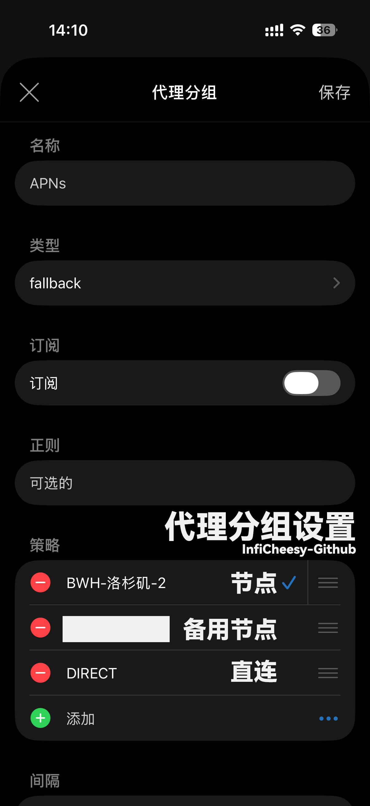
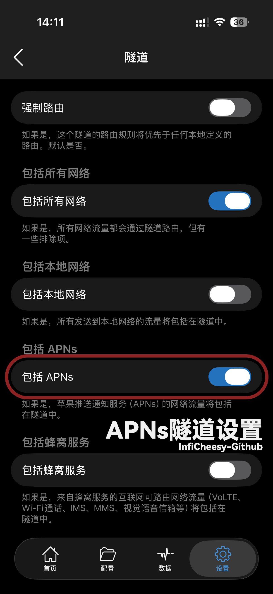
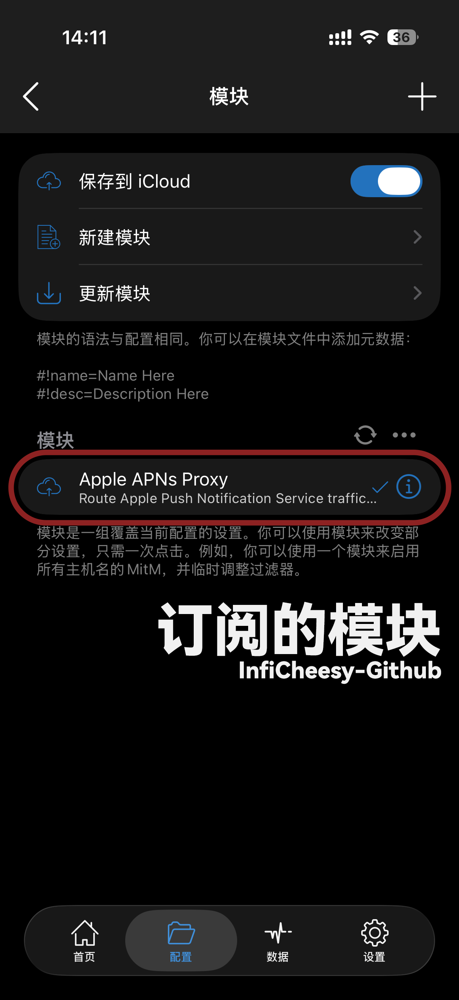

# Apple Push Rules

为 Shadowrocket 提供一套尽量精准的 **Apple Push Notification service（APNs）代理规则**。

适用于部分中国大陆网络环境下，Telegram、X、Gmail、YouTube 等海外 App 出现 **App 可以正常使用，但锁屏通知不推送、延迟推送** 的情况。

本项目不会代理整个 `apple.com`，也不会代理整个 Apple `17.0.0.0/8` 网段，而是尽量只接管 APNs 相关域名与 Apple 官方 APNs 网络范围。

---

## 工作原理

iPhone 上绝大多数 App 的系统通知并不是 App 自己直接发送到手机，而是通过 Apple 的 APNs：

```text
Telegram / X / Gmail / 微信 / 银行 App
                    ↓
                Apple APNs
                    ↓
                  iPhone
```

本项目的思路是：

```text
普通国内流量 → DIRECT

海外 App 流量 → 按你原有 Shadowrocket 规则处理

Apple APNs
    ↓
APNs 策略组
    ├─ 自建海外节点
    ├─ 备用代理节点
    └─ DIRECT
```

这样可以尽可能减少对其他 Apple 服务和国内网络流量的影响。

---

## 一、准备 APNs 策略组

首先在 Shadowrocket 当前配置中建立一个名为：

```text
APNs
```

的策略组。

推荐使用 `fallback` 类型，例如：

```text
APNs
├── 自建海外节点
├── 备用机场节点
└── DIRECT
```

推荐顺序：

1. 自己最稳定的海外 VPS
2. 一个稳定的备用代理节点
3. `DIRECT`

最后保留 `DIRECT` 很重要。

如果两个代理节点全部故障，APNs 至少还可以退回中国大陆网络直连，避免因为代理服务器故障导致整台 iPhone 的通知全部中断。

> **图片 1：APNs 策略组截图**
> 

---

## 二、开启 Shadowrocket 的 APNs 接管

进入：

**Shadowrocket → 设置 → 隧道**

建议开启：

```text
包括所有网络    ✅
包括 APNs       ✅

包括本地网络    ❌
包括蜂窝服务    ❌
```

其中最关键的是：

```text
包括 APNs
```

如果不开启该选项，APNs 属于 iOS 系统级网络连接，相关流量可能不会进入 Shadowrocket 隧道，即使规则本身已经写好，也可能无法命中。

不建议为了 APNs 开启：

```text
包括本地网络
包括蜂窝服务
```

因为它们还可能影响 AirDrop、AirPlay、CarPlay、VoLTE、Wi-Fi Calling、IMS 等其他系统网络功能。

> **图片 2：Shadowrocket 隧道设置截图**
>
> 最好清楚显示：
>
> ```text
> 包括所有网络    开
> 包括 APNs       开
> 包括本地网络    关
> 包括蜂窝服务    关
> ```
>
> 建议文件名：
>
> `images/shadowrocket-tunnel.png`



---

## 三、订阅 APNs 模块

打开：

**Shadowrocket → 配置 → 模块 → `+`**

添加下面的远程模块地址：

```text
https://raw.githubusercontent.com/InfiCheesy/apple-push-rules/main/apns.module
```

下载成功以后，打开：

```text
Apple APNs Proxy
```

模块开关。

以后本仓库更新规则时，只需要在 Shadowrocket 中更新模块，无需再次手动添加每一条规则。

> **图片 3：Shadowrocket 模块页面截图**
>
> 建议截图中显示：
>
> * `Apple APNs Proxy`
> * 模块已经启用
> * 远程模块 URL
>
> 建议文件名：
>
> `images/apns-module.png`



---

## 四、当前规则

本项目目前使用：

```ini
#!name=Apple APNs Proxy
#!desc=Route Apple Push Notification Service traffic through APNs policy group

[Rule]
DOMAIN-SUFFIX,push.apple.com,APNs

IP-CIDR,17.249.0.0/16,APNs,no-resolve
IP-CIDR,17.252.0.0/16,APNs,no-resolve
IP-CIDR,17.57.144.0/22,APNs,no-resolve
IP-CIDR,17.188.128.0/18,APNs,no-resolve
IP-CIDR,17.188.20.0/23,APNs,no-resolve

IP-CIDR6,2620:149:a44::/48,APNs,no-resolve
IP-CIDR6,2403:300:a42::/48,APNs,no-resolve
IP-CIDR6,2403:300:a51::/48,APNs,no-resolve
IP-CIDR6,2a01:b740:a42::/48,APNs,no-resolve
```

这些规则主要匹配：

```text
*.push.apple.com
```

以及 Apple APNs 使用的部分 IPv4 / IPv6 网络范围。

---

## 五、为什么没有使用 DST-PORT,5223？

APNs 的主要连接端口之一确实是：

```text
TCP 5223
```

但本项目没有使用：

```text
DST-PORT,5223,APNs
```

原因是这种写法按照“端口”进行匹配，而不是按照“Apple APNs”进行匹配。

与此同时，APNs 在特定情况下也可能使用 TCP 443。

因此本项目更倾向于：

```text
APNs 域名
+
APNs IP 网段
```

而不是：

```text
所有 5223 流量
```

尽量减少误代理其他流量的可能性。

---

## 六、配置完成后重新建立 APNs 连接

APNs 使用持续的长连接。

因此刚刚修改规则以后，原来的 APNs 连接可能仍然存在。

推荐完成全部配置后：

```text
关闭 Shadowrocket
        ↓
开启飞行模式
        ↓
等待约 10 秒
        ↓
关闭飞行模式
        ↓
等待网络恢复
        ↓
重新开启 Shadowrocket
```

这样可以强制 iOS 重新建立 APNs 网络连接。

---

## 七、如何验证是否生效

可以让其他设备或账号给自己发送：

```text
Telegram 消息
X 通知
Gmail 邮件
YouTube 通知
```

随后查看 Shadowrocket 的连接记录。

重点观察是否出现：

```text
*.push.apple.com
```

或者目标地址属于本项目所使用的 APNs IP 范围。

正确情况下应该类似：

```text
Apple APNs
     ↓
APNs
     ↓
自建海外节点
```

如果同时恢复了此前无法正常收到的海外 App 通知，基本说明配置已经生效。

---

## 八、重要说明：无法区分国内和海外 App 的 APNs

这是使用本项目之前必须理解的一点。

iOS 的 APNs 是系统级推送通道。

Shadowrocket 无法简单实现：

```text
Telegram 通知 → PROXY
微信通知     → DIRECT
```

对于手机这一端来说，它们最终都通过 Apple APNs 到达。

因此开启本项目后，在 Shadowrocket 工作期间：

```text
Telegram 通知 ─┐
X 通知        ─┤
微信通知      ─┤
淘宝通知      ─┤→ APNs → APNs 策略组
银行通知      ─┘
```

但是这**不代表微信、淘宝、银行 App 本身的正常网络请求也经过代理**。

例如仍然可以保持：

```text
微信 App 网络 → DIRECT
淘宝 App 网络 → DIRECT
银行 App 网络 → DIRECT

Apple APNs → 海外节点
```

代理的只是 Apple Push 通道。

---

## 九、关闭 Shadowrocket 后会怎样？

关闭 Shadowrocket 后，本项目不会继续接管系统网络。

此时恢复为：

```text
APNs → 中国大陆网络直连 Apple
```

所以正常情况下：

```text
微信
支付宝
淘宝
国内银行 App
```

等国内软件的通知仍然可以正常接收。

但是此前存在 APNs 推送异常的海外 App，也可能重新出现：

```text
通知延迟
通知丢失
锁屏不推送
```

等现象。

---

## 十、可能的副作用

### 所有 APNs 都会经过代理

开启 Shadowrocket 并接管 APNs 后，无法只代理 Telegram、X 等海外 App 的通知。

国内 App 使用 APNs 的通知同样会经过 `APNs` 策略组。

### 代理节点故障可能影响通知

因此强烈建议使用：

```text
自建节点
↓
备用节点
↓
DIRECT
```

而不要把 APNs 永久绑定到一个没有备用线路的代理节点。

### 节点不稳定可能增加耗电

APNs 本身是长连接。

如果代理节点频繁断线：

```text
连接
↓
断开
↓
重新连接
↓
再次断开
```

iOS 会不断重新建立相关连接，可能增加耗电并造成通知延迟。

因此 APNs 更适合使用：

> **稳定性高的节点，而不是单纯延迟最低的节点。**

---

## 十一、不建议使用的规则

为了减少副作用，本项目默认不使用：

```text
DST-PORT,5223,APNs
DOMAIN-SUFFIX,apple.com,APNs
IP-CIDR,17.0.0.0/8,APNs
```

特别是：

```text
17.0.0.0/8
```

覆盖的是非常庞大的 Apple 网络范围，会把大量与 Push 无关的 Apple 服务一起代理，没有必要。

本项目的目标始终是：

> **能少代理就少代理，只处理真正需要处理的 APNs 流量。**

---

## 十二、故障排查

如果配置完成后仍然没有通知，可以依次检查：

```text
1. Shadowrocket 是否正在运行
2. 「包括 APNs」是否开启
3. Apple APNs Proxy 模块是否开启
4. 当前配置中是否存在名为 APNs 的策略组
5. APNs 策略组中的代理节点是否可用
6. 是否开关过一次飞行模式
7. Shadowrocket 日志是否有 APNs 连接
```

如果模块提示找不到：

```text
APNs
```

通常说明你的 Shadowrocket 主配置中还没有创建名为：

```text
APNs
```

的策略组。

---

## 更新

远程模块地址长期保持：

```text
https://raw.githubusercontent.com/InfiCheesy/apple-push-rules/main/apns.module
```

更新 GitHub 中的：

```text
apns.module
```

以后，只需要在 Shadowrocket 中更新远程模块即可同步最新规则。

---

## Disclaimer

本项目仅提供 Shadowrocket 网络分流规则。

不同运营商、不同 iOS 版本、不同网络环境以及不同 App 的推送机制可能存在差异，因此无法保证所有设备均能解决通知问题。

本项目不修改 iOS，不修改 App，不修改 Apple Push 服务，仅改变相关网络连接的出口路径。
